# Master Seminar - Unsupervised Anomaly Detection for Medical Imaging

Most of the code (structure, dataloader class and evaluation) was provided by our supervisors Felix Meissen and Cosmin-Ionut Bercea. Check out their code [here](https://github.com/compai-lab/mad_seminar_s23/tree/main).

# DDIM with Classifier Guidance

This code re-implements, trains and evaluates the Denoising Diffusion Implicit Model (DDIM) with Classifier Guidance introduced in the paper "[Diffusion Models for Medical Anomaly Detection](https://doi.org/10.1007/978-3-031-16452-1_4)". Here is a brief overview of the model:

<p align="center">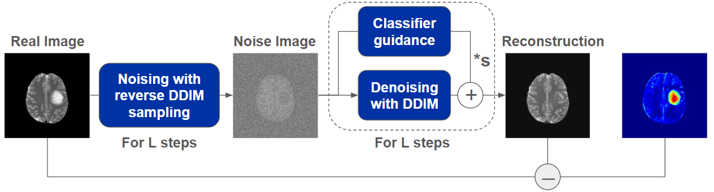</p>

For both training and evaluation we use a small dataset of brain MRI scans. The dataset contains images of heathy patients and different pathologies.
Since we are going to use the normal vs. pathological scans the approach is semi-supervised. Here you can see some samples of our dataset:

| Absent Septum | Encephalomalacia | Intraventricular | Craniatomy | Enlarged Ventricles | Normal |
| :---: | :---: | :---: | :---: | :---: | :---: |
||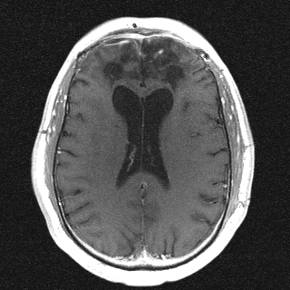|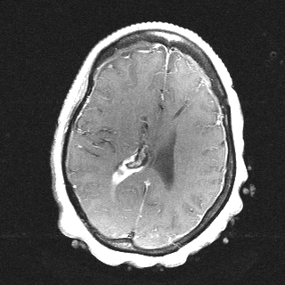|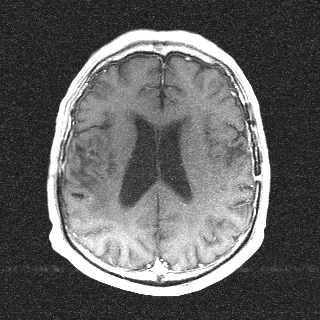|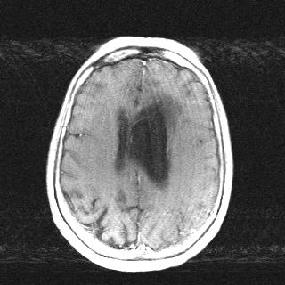|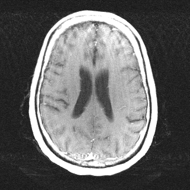|

## Installation

Create (and activate) a new virtual environment (requires conda) and install the required packages
```shell
conda create --name mad python=3.9
conda activate mad
pip install -r requirements.txt
```

## Training

To train the DDIM with Classifier GUidance we need to train the DDIM and the Classifier separately.

### Train Classifier

First, we train the classifier to distinguish healthy from pathological scans.
We feed noisy images to the classifier during training since we are going to use the classifier gradients on the noisy reconstruction in the denoising process of the DDIM to shift the reconstruction towards heathy images.
We also trained the classifier on the Decathlon dataset because \
The training is done in [train_classifier.ipynb](./train_classifier.ipynb).

### Train DDIM

We train the diffusion model as a DDPM by estimating the noise added to the image at each step of the diffusion process. Adding the noise follows the diffusion process described in the paper. The training is done in [main.ipynb](./main.ipynb).

### Training Curves

| DDIM | Classifier | Classifier (On Decathlon Dataset) |
| --- | --- | --- |
|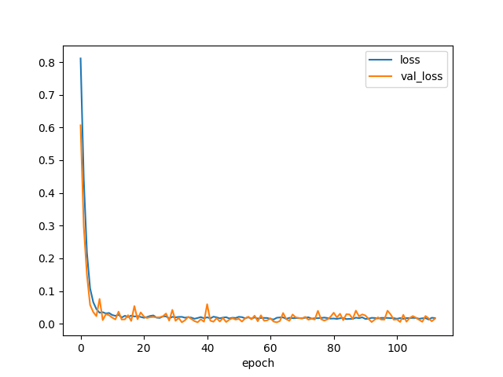|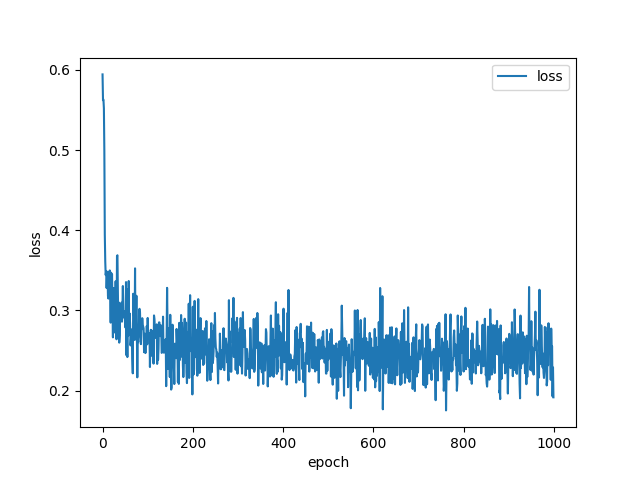|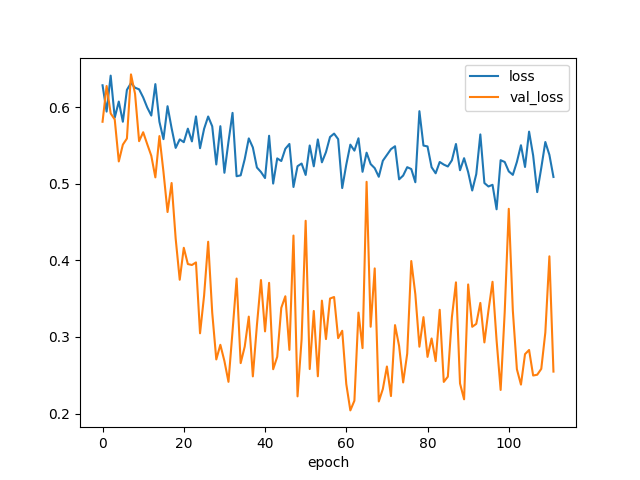|

## Evaluation

To see all experiment results check-out the experiments folder

### Image generation ability of the DDIM (no Classifier Guidance)

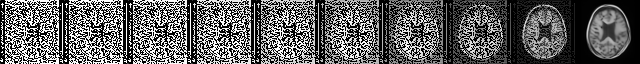

### Full Reconstruction (noising + guidaed denoising)

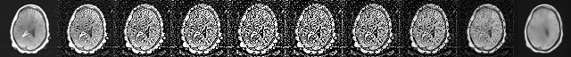

### Gradients during Denoising Process

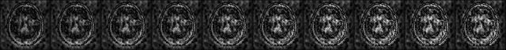

### Animated Gifs of Reconstruction

Noising Process | Denoising Process | Gradients during DP | Full Reconstruction
| :---: | :---: | :---: | :---: |
| 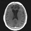|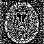|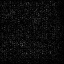| |

### Reconstruction and Anomaly Maps of MRI Scans

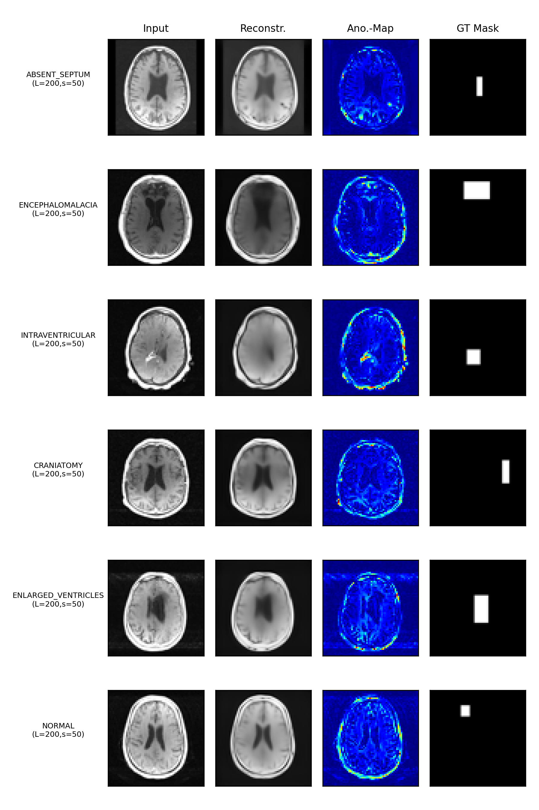

## Conclusion

Looking at Anomaly maps, we can see that the model is not able to find and remove the anomalies in the images. This is due to the fact that the classifier is not able to learn to distinguish the healthy from the pathological images. This is probably due to the fact that the classifier is trained on a relatively small dataset which is also reflected in the training curves of the classifier. However, the classifier performs better on the Decathlon dataset even though it is even smaller (388 training samples vs 1200 in our data). This could be because the differences between the classes are more pronounced in the Decathlon dataset but further investigation is needed to confirm this.

Looking at the image reconstruction of the DDIM without the classifier guidance, we can see that the model is able to generate images that look like the input images. Due to the fact that the gradients of the classifier during denoising do not vanish as the image looks more like a healthy image, the classifier keeps adding noise to the image which results in a noisy reconstruction.

The best way to improve the model would be to use a more performant classifier that for example was trained on a larger dataset or with the use of data augmentation.
Another idea is to remove the classifier guidance from the last few steps of the denoising process to avoid the noisy reconstruction.
This assumes however that the anomalies cannot removed by the DDIM within these few steps. This might hold true for large anomalies but not for small ones.
